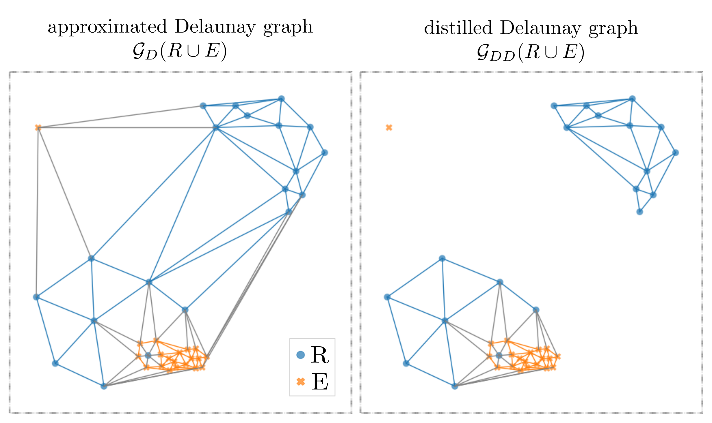

# Delaunay Component Analysis (DCA)
Official Python implementation of the Delaunay Component Analysis (DCA) algorithm presented in the paper [Delaunay Component Analysis for Evaluation of Data Representations](https://openreview.net/forum?id=HTVch9AMPa). If you use this code in your work, please cite it as follows:

## Citation

```
@inproceedings{
    poklukar2022delaunay,
    title={Delaunay Component Analysis for Evaluation of Data Representations},
    author={Petra Poklukar and Vladislav Polianskii and Anastasiia Varava and Florian T. Pokorny and Danica Kragic Jensfelt},
    booktitle={International Conference on Learning Representations},
    year={2022},
    url={https://openreview.net/forum?id=HTVch9AMPa}
}
```

## Getting started
### Setup

Install the requirements with [poetry](https://python-poetry.org/docs/):

```
poetry install
chmod +x dca/approximate_Delaunay_graph
```
Note: Delaunay graph building algorithm requires access to a GPU.


### First example

1. Run a 2D example that saves the intermediate files:

```
poetry run python examples/first_example.py 
```

2. Check out the results saved `output/first_example` which will have the following structure:

```
experiments/first_example/
  /precomputed
    - clusterer.pkl               # HDBSCAN clusterer object
    - input_array.npy             # array of R and E points
    - input_array_comp_labels.npy # array of component labels corresponding to R and E points
    - unfiltered_edges.npy        # array of unfiltered approximated Delaunay edges
    - unfiltered_edges_len.npy    # array of unfiltered approximated Delaunay edge lengths
  /template_id1
    - output.json                 # dca scores 
    /DCA
        - components_stats.pkl    # Local evaluation scores
        - network_stats.pkl       # Global evaluation scores
    /visualization
        - graph visualizations
    /logs
        - version0_elapsed_time.log      # empirical runtime 
        - version0_input.json            # specific input parameters
        - version0_output_formatted.log  # all evaluation scores in a pretty format
        - version0_experiment_info.log   # console logs
        - # output files from qDCA
        - # any additional logs that should not be shared across experiment_ids in precomputed folder
```
Note: you can modify the experiment structure by definining what is shared across several experiments, e.g., what goes in the `output/first_example/precomputed` folder. For examples, see `CL_ablation_study.py`.


3. In `output/first_example/template_id1/visualization` folder you should see an image of the approximated Delaunay graph and the distilled Delaunay graph like the ones below:



4. In `output/first_example/template_id1/logs/version0_output_formatted.log` you should see the following output:

```
[mm/dd/yyyy hh:mm:ss] :: num_R: 20                            # total number of R points
[mm/dd/yyyy hh:mm:ss] :: num_E: 20                            # total number of E points
[mm/dd/yyyy hh:mm:ss] :: precision: 0.95                      
[mm/dd/yyyy hh:mm:ss] :: recall: 0.4
[mm/dd/yyyy hh:mm:ss] :: network_consistency: 1.0
[mm/dd/yyyy hh:mm:ss] :: network_quality: 0.2
[mm/dd/yyyy hh:mm:ss] :: first_trivial_component_idx: 2       # idx of the first outlier
[mm/dd/yyyy hh:mm:ss] :: num_R_points_in_fundcomp: 8          # number of vertices in F^R
[mm/dd/yyyy hh:mm:ss] :: num_E_points_in_fundcomp: 19         # number of vertices in F^E
[mm/dd/yyyy hh:mm:ss] :: num_RE_edges: 19                     # number of heterogeneous edges in G_DD
[mm/dd/yyyy hh:mm:ss] :: num_total_edges: 95                  # number of all edges in G_DD
[mm/dd/yyyy hh:mm:ss] :: num_R_outliers: 0                    
[mm/dd/yyyy hh:mm:ss] :: num_E_outliers: 1
[mm/dd/yyyy hh:mm:ss] :: num_fundcomp: 1                      # number of fundamental components |F|
[mm/dd/yyyy hh:mm:ss] :: num_comp: 3                          # number of all connected components
[mm/dd/yyyy hh:mm:ss] :: num_outliercomp: 1                   # number of trivial components
# Local scores for each component G_i: consistency and quality (Def 3.2) as well as number of R and E points contained in it
[mm/dd/yyyy hh:mm:ss] :: c(G0): 0.59, q(G0): 0.27, |G0^R|_v: 8   , |G0^E|_v: 19  , |G0|_v: 27  
[mm/dd/yyyy hh:mm:ss] :: c(G1): 0.00, q(G1): 0.00, |G1^R|_v: 12  , |G1^E|_v: 0   , |G1|_v: 12  
[mm/dd/yyyy hh:mm:ss] :: c(G2): 0.00, q(G2): 0.00, |G2^R|_v: 0   , |G2^E|_v: 1   , |G2|_v: 1   
```

5. If you are only interested in the output DCA scores, the  `cleanup` function will remove all of the intermediate files for you. Test it on this 2D example by running 

```
poetry run python examples/first_example.py --cleanup 1
```
Note: to run q-DCA it is required to keep the intermediate files. This is because the distilled Delaunay graph is needed to calculate edges to the query points.


## Run DCA on your own representations

Minimum example requires you to define the input parameters as in the code below. See `dca/schemes.py` for the optional arguments of the input configs.

```
# Generate input parameters
data_config = REData(R=R, E=E)
experiment_config = ExperimentDirs(
    experiment_dir=experiment_path,
    experiment_id=experiment_id,
)
graph_config = DelaunayGraphParams()
hdbscan_config = HDBSCANParams()
geomCA_config = GeomCAParams()

# Initialize loggers
exp_loggers = DCALoggers(experiment_config.logs_dir)

# Run DCA
dca = DCA(
    experiment_config,
    graph_config,
    hdbscan_config,
    geomCA_config,
    loggers=exp_loggers,
)
dca_scores = dca.fit(data_config)
dca.cleanup()  # Optional cleanup
```


## Reproduce experiments in the paper
### Datasets

We used and adjusted datasets used in our eariler work [GeomCA](https://github.com/petrapoklukar/GeomCA). Therefore, we only provide the representations used in the contrastive learning experiment and q-DCA stylegan experiment, which you can download [on this link](https://drive.google.com/drive/folders/1oabsgnlFXBN1PlOYWWYsx2tGHJucacPb?usp=sharing) and save them in `representations/contrastive_learning` and `representations/stylegan` folders, respectively. For VGG16, we provide the code (see `VGG16_utils.py`) we used on the [splits constructed in GeomCA](https://drive.google.com/drive/u/1/folders/10Wneh93fAhV4F_oSIYTqspU8w5JUC72e). For StyleGAN mode truncation experiment, we refer the user either to the [splits we provided in GeomCA](https://drive.google.com/drive/u/1/folders/1y1Brzeg3Ig8LSCDma8WRz90Cex_jcXEU) or to the [code provided by Kynkäänniemi et. al](https://github.com/kynkaat/improved-precision-and-recall-metric).


### Section 4.1: Contrastive Learning

Reproduce <em>Varying component density</em> experiment:

```
poetry run python experiments/contrastive_learning/CL_varying_component_density.py --n-iterations 10 --perc-to-discard 0.5 --cleanup 1
```

Reproduce <em>Cluster assignment</em> experiment, for example, using query set Q2 and considering flexible assignment procedure:

```
poetry run python experiments/contrastive_learning/CL_qDCA.py Df query_Df_holdout_c7_to_c11 --run-dca 1 --run-qdca 1 --several-assignments 1 --cleanup 1
```

Reproduce <em>Mode truncation</em> experiment in Appendix B.1:

```
poetry run python experiments/contrastive_learning/CL_mode_truncation.py --cleanup 1
```

Reproduce <em>Ablation study</em> experiments in Appendix B.1:

```
poetry run python experiments/contrastive_learning/CL_ablation_study.py cl-ablation-delaunay-edge-approximation --cleanup 1
poetry run python experiments/contrastive_learning/CL_ablation_study.py cl-ablation-delaunay-edge-filtering --cleanup 1
poetry run python experiments/contrastive_learning/CL_ablation_study.py cl-ablation-hdbscan --cleanup 1
```


### Section 4.2: StyleGAN
Reproduce <em>Mode truncation</em> experiment, for example, on truncation 0.5 and 5000 representations provided by [Poklukar et. al in GeomCA](https://drive.google.com/drive/u/1/folders/1y1Brzeg3Ig8LSCDma8WRz90Cex_jcXEU):

```
poetry run python experiments/stylegan/StyleGAN_mode_truncation.py 0.5 --num-samples "5000" --cleanup 1
```

Reproduce <em>Quality of individual generated images</em> experiment using qDCA, for example, on truncation 0.5 --cleanup 1

```
poetry run python experiments/stylegan/StyleGAN_qDCA.py --run-dca 1 --run-qdca 1 --cleanup 1
```


### Section 4.3: VGG16

Reproduce <em>Class separability</em> experiment, for example, on version 1 containing classes of dogs and kitchen utils

```
poetry run python experiments/vgg16/VGG16_class_separability.py --version-id 1 --cleanup 1 
```

Reproduce <em>Amending labelling inconsistencies</em> experiment using qDCA, for example, on version 1 containing classes of dogs and kitchen utils

```
poetry run python experiments/vgg16/VGG16_qDCA.py --version-id 1 --run-dca 1 --run-qdca 1 --cleanup 1
```


